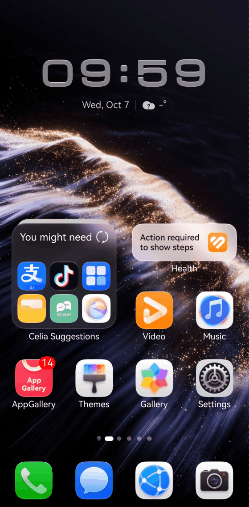

# DevEcoStudioProjects
For HarmonyOS program

鸿蒙（HarmonyOS）示例项目集合，使用 DevEco Studio + ArkTS / ArkUI 开发，目前包含以下两个 Demo。

## 目录

| # | Demo | 简介 | 说明文档 | 演示 |
| :- | :--- | :--- | :--- | :--- |
| 1 | **Standard_Chartered_OA_demo** | 渣打银行风格移动银行 / OA 示例：账户余额、存款 / 取款、关键字搜索 | [README](./Standard_Chartered_OA_demo/README.md) | [sc_demo.gif](./Standard_Chartered_OA_demo/sc_demo.gif) |
| 2 | **marshall_demo** | Marshall 音频设备蓝牙连接与控制示例：添加设备、蓝牙配对引导、产品浏览与设置 | [README](./marshall_demo/README.md) | [marshall_demo_record.gif](./marshall_demo/marshall_demo_record.gif) |

---

## 1. Standard_Chartered_OA_demo（渣打银行移动银行 / OA）

基于 HarmonyOS 的 Standard Chartered（渣打银行）风格移动银行 / OA 演示应用，通过底部两个 Tab 组织功能：

- **账户页**：展示账号（ACC01）、银行 Logo 与当前余额卡片；输入金额后可进行 **存款（Deposit）/ 取款（Withdraw）**，余额实时更新。
- **搜索页**：顶部搜索框，按关键字过滤结果并以列表展示（返回前 3 条），数据来自内置的 mock HTTP 请求。

- 说明文档：[Standard_Chartered_OA_demo/README.md](./Standard_Chartered_OA_demo/README.md)
- 包名：`com.example.q1_graphic`

---

## 2. marshall_demo（Marshall 音频设备蓝牙连接与控制）

基于 HarmonyOS 的 Marshall（马歇尔）风格音频设备伴侣应用，核心用途是通过蓝牙连接并控制 Marshall 系列蓝牙音箱与耳机（ACTON / STANMORE / WOBURN / EMBERTON / BROMLEY、MAJOR / MINOR / MODE 等）。

- **家用**：引导页与「添加新设备」流程，内置兼容产品分类清单。
- **探索**：BROMLEY 750 活动横幅与分类产品浏览，点击跳转 Marshall 官网。
- **更多**：蓝牙配对帮助、资讯订阅、改进计划、语言、协议、开源软件、关于与版本号等设置。

- 说明文档：[marshall_demo/README.md](./marshall_demo/README.md)
- 包名：`com.example.marshall_demo`

---

## 通用技术栈

- **操作系统**：HarmonyOS NEXT
- **开发语言**：ArkTS
- **UI 框架**：ArkUI（声明式开发范式）
- **开发工具**：DevEco Studio

## 快速开始

1. 使用 DevEco Studio 打开对应 Demo 目录（或本根目录）。
2. 等待 Hvigor 同步完成。
3. 打开各 Demo 的 `entry/src/main/ets/pages/Index.ets`，使用 **Previewer** 预览，或通过 **Run** 安装到鸿蒙真机运行。
